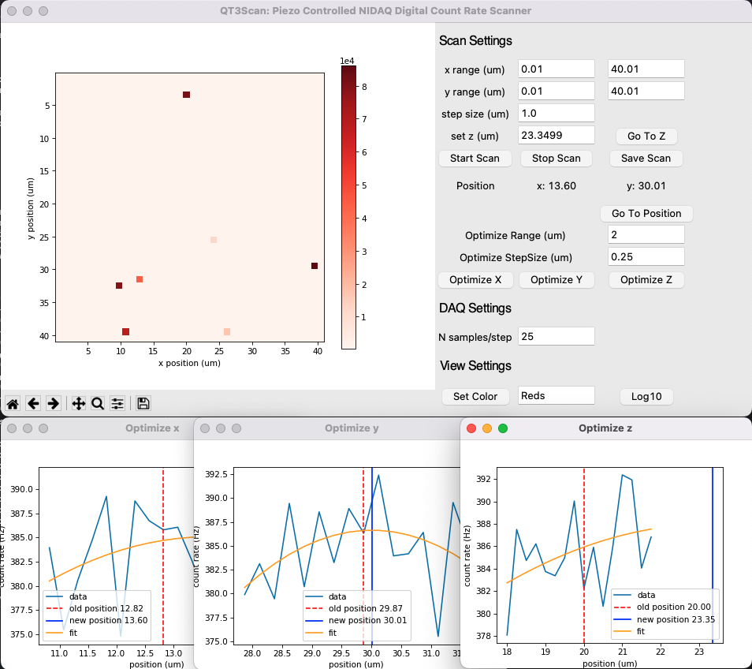

# Software for the Quantum Technologies Teaching and Test-Bed (QT3) Laboratory

This provides a brief overview of the Python-based software available to run
experiments in the QT3 Lab. These tools were developed for the confocal
microscope and its specific set of hardware. However, many of these
components should be reusable on other microscopes with similar setups.

### Goals

There were a number of development goals when the QT3 software construction began.

  * Python package delivery
  * foundational API for extended development by lab and community members
  * general support for hardware configuration
  * well written documentation
  * basic GUI applications

## Hardware

The programmable hardware currently used on the confocal microscope in QT3 (Sep 2022) are

  * National Instruments PCIx-6363 data acquisition card (NIDAQ)
  * Windfreak PRO RF Synthesizer (microwave source)
  * Quantum Composer Sapphire 4-channel TTL pulse generator
  * Spin Core Pulse Blaster

Additionally, there are

  * Jena Systems's Piezo Actuator stage controlled via NIDAQ
  * AOM driver controlled by TTL
  * Microwave switch controlled by TTL
  * Excelitas SPCM photon detector, which
    * produces 50 ns TTL pulse output / photon
    * connects via BNC to digital input on NIDAQ
  * Arduino-controlled Neutral Density wheel for laser power control

The `qt3utils` software configures readout of NIDAQ and can return raw counts
or count rates of the input TTL signal from the SPCM.  

Finally, TTL pulses provided by the QC Sapphire (or Pulse Blaster) are used to provide

 * clock signal
 * trigger signal

to the NIDAQ.

## Overview of Packages

The following packages have been developed

* [qt3-utils](https://github.com/qt3uw/qt3utils)
* [qt3rfsynthcontrol](https://github.com/qt3uw/qt3RFSynthControl)
* [qcsapphire](https://github.com/qt3uw/qcsapphire)
* [nipiezeojenapy](https://github.com/qt3uw/nipiezeojenapy)
* [pulseblaster](https://github.com/zeeshawnkazi/pulseblaster)
* [qt3laserpowercontrol](https://github.com/qt3uw/qt3laserpowercontrol)

### QT3-Utils

The [`qt3-utils` package](https://github.com/gadamc/qt3-utils) is the primary package
that experimenters will interact with directly. The `qt3utils` package provides

  * NIDAQ configuration (via `nidaqmx`)
  * high level objects for data acquisition
    * raw data sampler
    * piezo scanner
  * "standard" experiment objects (CWODMR, Rabi, pulsed-ODMR, etc)
  * GUI applications
    * qt3scope
    * qt3scan

##### GUI Application: QT3Scope

The `qt3scope` measures the event rate of a TTL pulse connected to a digital input channel on
the NIDAQ as a function of time (and appears like an oscilloscope)

The `qt3-utils` package installs the `qt3scope` application and is launched
from the command-line (on Windows, the Anaconda Powershell has been used).

```
> qt3scope
```


NB: The data shown here are randomly generated values and the GUI style will be different on Windows

##### GUI Application: QT3Scan

The `qt3scan`, installed by `qt3-utils`, measures the event rate of a TTL pulse
connected to a digital input channel on the NIDAQ as a function of position,
as controlled by the Jena Piezo controller.

```
> qt3scan
```



NB: The data shown here are randomly generated values and the GUI style will be different on Windows

While `qt3scan` and `qt3scope` can run simultaneously, they cannot sample data
from the NIDAQ simultaneously. One must stop acquisition in one application before
starting acquisition in the other. However, the applications can remain open.
Attempting to acquire data in both applications simultaneously will result in error messages
displayed in the console / shell.

#### Programmatic Usage

Potentially more useful than the GUIs are the high level software objects that interact with the
hardware and provide methods for data acquisition. This will support
long running or more advanced experiments. These mid- and high-level objects
found in the following examples are also used as the foundational pieces for the GUI applications.
These high level objects are useful within Jupyter notebooks, allowing the
experimenter full control and visualization.

* [CWODMR](https://github.com/gadamc/qt3-utils/blob/main/examples/default_cwodmr.ipynb)
* [Pulsed-ODMR](https://github.com/gadamc/qt3-utils/blob/main/examples/default_podmr.ipynb)
* [Rabi](https://github.com/gadamc/qt3-utils/blob/main/examples/default_rabi.ipynb)
* [Confocal-Scan](https://github.com/gadamc/qt3-utils/blob/main/examples/confocal-scan.ipynb)

### Piezo Control

The `nipiezeojenapy` package controls the Jena piezo stage controller via the NIDAQ.

The software is quite simple and can be used entirely stand-alone.

https://github.com/gadamc/nipiezeojenapy

For example

```python
import nipiezojenapy
pcon = nipiezojenapy.PiezoControl(device_name = 'Dev1',
                                  write_channels = ['ao0','ao1','ao2'],
                                  read_channels = ['ai0','ai1','ai2'])
print(pcon.get_current_position())
#[39.953595487425225, 40.047631567251806, 39.9510191567554]

pcon.go_to_position(x = 20, y = 20, z = 20)
pcon.get_current_position()
#[19.935887437291537, 19.94876864898489, 19.872769502734947]
```

#### GUI Application: QT3Piezo

The `nipiezojenapy` package installs the `qt3piezo` application, which
is launched from the command-line / powershell.

```
> qt3piezo
```


NB: The GUI style will be different on Windows

It should also be noted that `nipiezojenapy` does NOT block usage of the NIDAQ
to other programs. Thus, one can use this GUI application in conjunction
with `qt3scope` and `qt3scan` while they are running.


### QC Sapphire

The QC Sapphire TTL pulser can be controlled through a purely Pythonic API.

The [GH repo provides full documentation](https://github.com/gadamc/qcsapphire).

From that documentation, the following example shows one simple usage

```python
import qcsapphire

pulser = qcsapphire.Pulser('COM6')

total_width = 10e-6 #in seconds
pulser.system.period(total_width)

channel = pulser.channel('B') #QC Sapphire channel B is connected to the MW amplifier switch
channel.mode('normal')

#create a 5 microsecond pulse
#round to nearest 10ns bc QCSapphire does not behave well with machine errors
channel.width(np.round(total_width/2, 8))
channel.delay(0)

channel.state(1)
pulser.system.state(1) #start the pulser
```

The QC Sapphire is used extensively in the standard `qt3-utils` experiment objects.


### Windfreak RF Synthesizer Control

The [qt3rfsynthcontrol](https://github.com/gadamc/qt3RFSynthControl)
package provides high-level objects to programmatically control the Windfreak RF Synthesizer Pro.
Like the QC Sapphire pulser, this package is used extensively within the standard
experiment classes found in `qt3-utils`.

The following provides a short example of usage

```python
import qt3rfsynthcontrol
rf_synth = qt3rfsynthcontrol.QT3SynthHD('COM5')

rf_synth.rf_off(0) #0 = channel A, 1 = channel B
rf_synth.set_power(-5) #dbmW
rf_synth.set_frequency(2870e6)
rf_synth.rf_on(1)
```

### Spin Core Pulse Blaster

The [pulseblaster](https://github.com/zeeshawnkazi/pulseblaster) has yet to be
used on the confocal setup, but will soon be incorporated into the standard
experiment classes.

### QT3 Laser Power Control

The [qt3laserpowercontrol](https://github.com/gadamc/qt3laserpowercontrol) aims
to provide the experimenter with control of laser power via an ND wheel placed
in the path of the laser. The position of the ND wheel is controlled by an
applied voltage, supplied by a programmable Arduino board. At the moment,
this tool is accessible through a GUI interface.  
