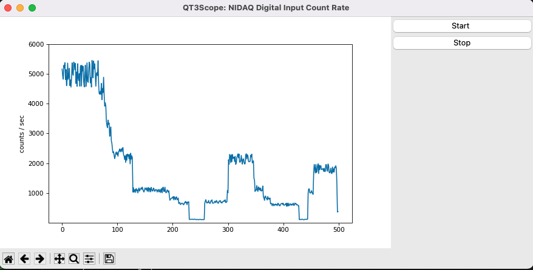
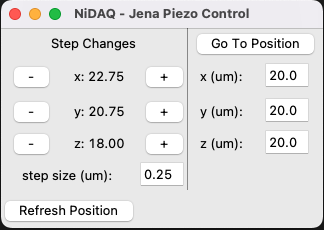

# Software for the Quantum Technologies Teaching and Test-Bed (QT3) Laboratory

This provides a brief overview of the Python-based software available to run
experiments in the QT3 Lab. These tools were developed for the confocal
microscope and its specific set of hardware. However, many of these
components should be reusable on other microscopes with similar setups.

### Goals

There were a number of development goals when the QT3 software construction began.

  * Python package delivery
  * foundational API for extended development by lab and community members
  * general support for hardware configuration
  * well written documentation
  * basic GUI applications

## Hardware

The programmable hardware currently used on the confocal microscope in QT3 (Sep 2022) are

  * National Instruments PCIx-6363 data acquisition card (NIDAQ)
  * Windfreak PRO RF Synthesizer (microwave source)
  * Quantum Composer Sapphire 4-channel TTL pulse generator
  * Spin Core Pulse Blaster

Additionally, the Jena Systems's Piezo Actuator stage can be controlled via
the NIDAQ, and switches for an AOM and microwave amplifier can be controlled
via TTL pulses.

The Excelitas SPCM is the photon detector used in the lab. The SCPM produces a 50 ns
TTL pulse upon the detection of a photon. The TTL pulse is connected via BNC to
a digital input channel on the NI-DAQ. The `qt3utils` software configures readout of this
digital input channel and can return raw counts as well as count rate. Since the SPCM
couples to the NIDAQ via TTL pulses over BNC, any other photon detector that produces
the same signal can be utilized.

Finally, to ensure robust data acquisition, TTL pulses are generated to provide a clock and
trigger of the NIDAQ. (As of now, only the QC Sapphire is programmed for performing this.)

## Overview of Packages

The following packages have been developed

* [qt3-utils](https://github.com/gadamc/qt3utils)
* [qt3RFSynthControl](https://github.com/gadamc/qt3RFSynthControl)
* [qcsapphire](https://github.com/gadamc/qcsapphire)
* [nipiezeojenapy](https://github.com/gadamc/nipiezeojenapy)
* [pulseblaster](https://github.com/zeeshawnkazi/pulseblaster)

### QT3-Utils

The [`qt3-utils` package](https://github.com/gadamc/qt3-utils) is the primary package
that experimenters will interact with directly. The `qt3utils` package provides

  * NIDAQ configuration (via `nidaqmx`)
  * high level objects for data acquisition
    * raw data sampler
    * piezo scanner
  * "canned" experiment objects (CWODMR, Rabi, pulsed-ODMR, etc)
  * GUI applications
    * qt3scope
    * qt3scan

##### GUI Application: QT3Scope

The `qt3scope` measures a TTL signal count rate to a digital input channel on
the NIDAQ as a function of time (and appears as an oscilloscope that is
measuring a voltage that is proportional to the count rate)

The `qt3-utils` package installs the `qt3scope` application and is launched
from the command-line. On Windows, the Anaconda Powershell application has been used.

```
> qt3scope
```



##### GUI Application: QT3Scan

The `qt3scan`, installed by `qt3-utils`, measures a TTL signal count rate to a
digital input channel on the NIDAQ as a function of position, as controlled by
the Jena Piezo controller.

```
> qt3scan
```


While `qt3scan` and `qt3scope` can run simultaneously, they cannot sample data
from the NIDAQ simultaneously. One must stop acquisition in one application before
starting acquisition in the other. However, the applications can remain open.
Attempting to acquire data in both applications simultaneously will result in error messages
displayed in the console / shell.

#### Programmatic Usage

Potentially more useful are the high level software objects that interact with the
hardware and provide methods for data acquisition. This will support
long running or more advanced experiments. These mid- and high-level objects
found in the following examples are also used as the foundational pieces for the GUI applications.

* [CWODMR](https://github.com/gadamc/qt3-utils/blob/main/examples/default_cwodmr.ipynb)
* [Pulsed-ODMR](https://github.com/gadamc/qt3-utils/blob/main/examples/default_podmr.ipynb)
* [Rabi](https://github.com/gadamc/qt3-utils/blob/main/examples/default_rabi.ipynb)
* [Confocal-Scan](https://github.com/gadamc/qt3-utils/blob/main/examples/confocal-scan.ipynb)

### Piezo Control

The `nipiezeojenapy` package controls the Jena piezo stage controller via the NIDAQ.

The package software is quite simple and can be used entirely stand-alone.

https://github.com/gadamc/nipiezeojenapy

For example

```python
import nipiezojenapy
pcon = nipiezojenapy.PiezoControl(device_name = 'Dev1',
                                  write_channels = ['ao0','ao1','ao2'],
                                  read_channels = ['ai0','ai1','ai2'])
print(pcon.get_current_position())
#[39.953595487425225, 40.047631567251806, 39.9510191567554]

pcon.go_to_position(x = 20, y = 20, z = 20)
pcon.get_current_position()
#[19.935887437291537, 19.94876864898489, 19.872769502734947]
```

#### GUI Application: QT3Piezo

This application is launched from the command-line / powershell.

```
> qt3piezo
```



It should also be noted that `nipiezojenapy` does NOT block usage of the NIDAQ
to other programs. Thus, one can use this GUI application in conjunction
with `qt3scope` and `qt3scan` while they are running.


### QC Sapphire

The QC Sapphire TTL pulser can be controlled through a purely Pythonic API.

The [GH repo provides full documentation](https://github.com/gadamc/qcsapphire).

From that documentation, the following quick example shows the usage

```python
import qcsapphire

pulser = qcsapphire.Pulser('COM6')

total_width = 10e-6 #in seconds
pulser.system.period(total_width)

#use channel B for RF switch and use 'normal' mode
channel = pulser.channel('B')
channel.mode('normal')

#create a 5 microsecond pulse
#round to nearest 10ns bc QCSapphire does not behave well with machine errors
channel.width(np.round(total_width/2, 8))
channel.delay(0)

channel.state(1)
pulser.system.state(1) #start the pulser
```

The QC Sapphire is used extensively in the canned `qt3-utils` experiment objects.


### Windfreak RF Synthesizer Control

The [qt3RFSynthControl](https://github.com/gadamc/qt3RFSynthControl)
package provides high-level objects to programmatically control the Windfreak RF Synthesizer Pro.
Like the QC Sapphire pulser, this package is used extensively within the canned
experiment classes found in `qt3-utils`.

The following provides a short example of usage

```python
import qt3rfsynthcontrol
rf_synth = qt3rfsynthcontrol.Pulser('COM5')

rf_synth.rf_off(0) #0 = channel A, 1 = channel B
rf_synth.set_power(-5) #dbmW
rf_synth.set_frequency(2870e6)
rf_synth.rf_on(1)
```

### Spin Core Pulse Blaster

The [pulseblaster](https://github.com/zeeshawnkazi/pulseblaster) has yet to be
used on the confocal setup.

## Next Steps

1. Verify naming of objects and applications
2. Build laser power monitoring / control package
3. Update qt3-utils to support the Pulse Blaster
